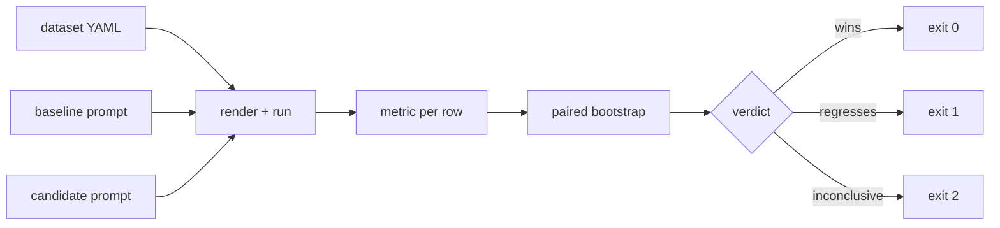

# prompt-eval-toolkit — A/B test your prompts before merging them

[](https://github.com/darrshangovender/prompt-eval-toolkit/actions/workflows/tests.yml)
[](LICENSE)
[](https://python.org)
[](prompt_eval/stats.py)

> A small CLI that runs two versions of a prompt against the same dataset and reports which one wins, by how much, and whether the difference survives a paired bootstrap. Exits non-zero on a regression so it can sit in CI.

**Why this exists.** Prompts get tweaked weekly. Engineers eyeball "this output looks better" and ship. Two weeks later a customer reports the bot hallucinating. The fix is unglamorous: treat a prompt change like a code change — run an eval, look at numbers, only merge if it wins. Most repos do this in a notebook nobody runs twice; a CLI that lives in CI is the difference between measuring and saying you measure.

Pairs with [prompt-versioner](https://github.com/darrshangovender/prompt-versioner), which stores and routes the version this tool decides to promote.

---

## Quick start

```bash
pip install -e ".[dev]"
```

```bash
prompt-eval compare \
    --baseline prompts/extractor_v1.txt \
    --candidate prompts/extractor_v2.txt \
    --dataset data/invoices.yml \
    --metric exact_match
```

The output shape (numbers below are **illustrative** — the shipped `data/invoices.yml`
is a 4-row demo set, and no run results are committed to this repo):

```
Baseline:    0.78
Candidate:   0.88
Δ            +0.10
p-value      0.038   95% CI: +0.02 .. +0.18

VERDICT: Candidate wins. Promote.
```

Or drive it as a library, with any callable as the model:

```python
from pathlib import Path
from prompt_eval.runner import load_dataset, run_prompt
from prompt_eval.metrics import REGISTRY
from prompt_eval.stats import compare

examples = load_dataset(Path("data/invoices.yml"))
metric = REGISTRY["exact_match"]

base = run_prompt(Path("prompts/extractor_v1.txt").read_text(), examples, call_model)
cand = run_prompt(Path("prompts/extractor_v2.txt").read_text(), examples, call_model)

result = compare(
    [metric(o, e.expected) for o, e in zip(base, examples)],
    [metric(o, e.expected) for o, e in zip(cand, examples)],
    n_bootstrap=5000,
)
print(result.delta, result.p_value, result.ci_low, result.ci_high)
```

## How it works



1. `load_dataset` reads the YAML into `Example(variables, expected)` rows.
2. `default_model_caller` picks Anthropic then OpenAI from whichever API key is in the environment.
3. `run_prompt` substitutes `{{ var }}` per row and calls the model — serially, once per row, per prompt.
4. The chosen metric scores each row to 0.0 or 1.0.
5. `compare` runs 5000 **paired** bootstrap resamples over the two score vectors.
6. The CLI prints means, delta, p-value and percentile CI, then exits with the verdict code.

## The metrics

| Metric | Implementation | Scores 1.0 when |
|---|---|---|
| `exact_match` | `output.strip().lower() == expected.strip().lower()` | the output is the expected string, modulo case and surrounding whitespace |
| `contains` | case-insensitive substring test | the expected string appears anywhere in the output |

Two metrics, both string-identity. That is the honest state of the registry — there is no LLM-as-judge metric in this repo.

## Design decisions

| Decision | Why |
|---|---|
| **Paired bootstrap, not a t-test** | Both prompts see the same rows, so the scores are correlated. Pairing the resample removes between-row variance and is far more sensitive on the 40–200 row datasets these evals actually use. |
| **Three exit codes, not two** | A CI gate needs to distinguish "this is worse" from "we don't have enough data to tell". Both block, but they call for different responses. |
| **Prompts are plain text files, datasets plain YAML** | Reviewable in a normal PR diff. A prompt buried in a Python string literal never gets read at review time. |
| **The model caller is just a `Callable[[str], str]`** | Bring your own client, your own retries, your own mocking. The toolkit has no opinion about who answers. |
| **Seeded RNG (`stats.py`)** | Reruns of the same data give the same verdict, so a CI failure is reproducible rather than a coin flip. |

## Limitations

- **The metrics are string comparisons.** Any paraphrase, reordering, or extra prose scores 0.0 — the exact failure mode LLM outputs exhibit. This tool is honest on extraction and classification tasks; it is close to useless on free-form generation. There is no LLM-as-judge metric here.
- **`render()` is strict in both directions** (`prompt_eval/runner.py`). It raises if a dataset row carries a variable the prompt doesn't reference, so you cannot keep metadata columns alongside inputs, and you cannot compare two prompts that use different variable subsets.
- **Serial, uncached, unretried model calls.** `run_prompt` is a plain loop. N rows × 2 prompts = 2N sequential API calls, re-paid on every run, with no rate-limit backoff. A 500-row eval is slow and expensive.
- **The p-value is a bootstrap sign-flip fraction, not a hypothesis test.** With a unanimous win no resampled delta flips sign and it prints `0.000`. The interval is a plain percentile CI, not BCa, and is biased at small n. Treat `p < 0.05` as a heuristic gate, not a claim about a null distribution.
- **The seeded RNG hides bootstrap variance.** Reruns are identical by construction, so you cannot detect an unstable estimate by re-running — you have to grow the dataset.
- **No cost, token, or latency accounting**, despite the tool existing to gate changes that move all three.

## Project layout

```
prompt-eval-toolkit/
├── prompt_eval/
│   ├── cli.py           # argparse + the `compare` subcommand
│   ├── runner.py        # dataset loading, {{var}} rendering, model dispatch
│   ├── stats.py         # paired bootstrap CI + p-value
│   └── metrics/         # exact_match · contains · REGISTRY
├── prompts/             # two demo prompt versions
├── data/invoices.yml    # 4-row demo dataset
└── tests/               # 40 tests, no API keys
```

A dataset row is just:

```yaml
- variables:
    text: "Invoice 12345 dated 2025-01-15"
  expected: "12345"
```

## Tests

```bash
pytest tests/ -q       # 40 tests, fully offline
```

The suite scrubs provider API keys from the environment so a stray key can never turn a unit test into a billed call. CI runs it on 3.11 and 3.12 on every push.

## Author

Darrshan Govender · [Agulhas Code](https://agulhascode.co.za) · Durban, South Africa
